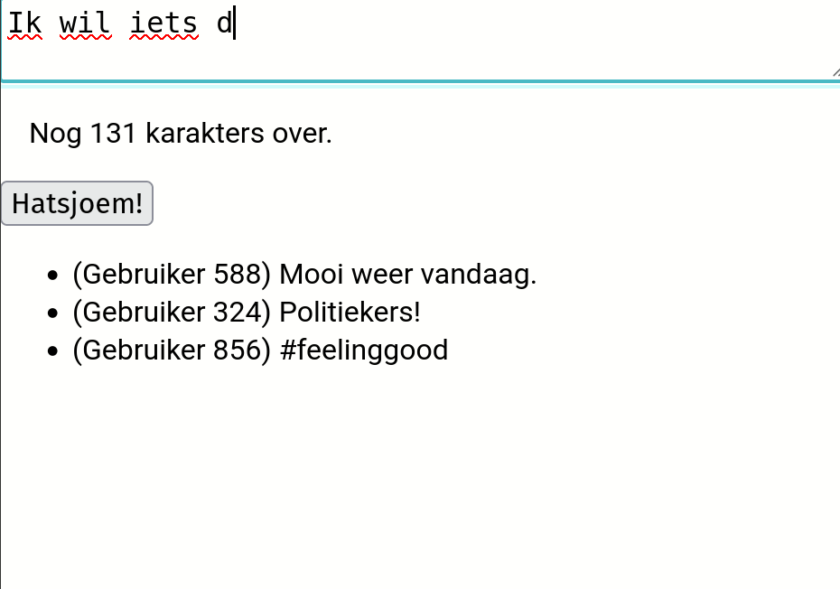

# Stap 17: sneezes posten
Nu de gebruiker ingelogd kan zijn en nu sneezes getoond kunnen worden, is het een logische stap om de gebruiker toe te laten nieuwe sneezes te posten. In deze stap werken we naar de functionaliteit die je hieronder gedemonstreerd ziet:

Dit vereist een aantal zaken:

- We willen asynchroon een request met daarin een payload kunnen afhandelen. Concreet houdt dit in dat er data in JSON-formaat naar de backend wordt gestuurd, zonder dat de frontend moet herladen.
- We willen dat dit leidt tot een `INSERT`-operatie in de database.
  - Een operatie op de database op basis van gebruikersinvoer houdt een risico op "SQL-injectie" in, dus we moeten hier maatregelen tegen nemen.
- We willen dat de gebruiker de nodige data terugkrijgt die bevestigt dat de sneeze is aangemaakt. Op basis hiervan kan de frontend updaten.
