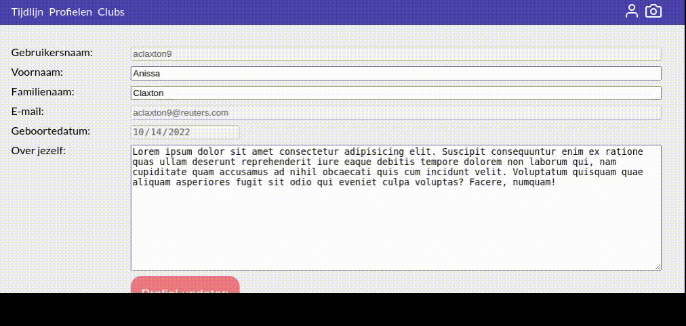

# Profiel updaten
Gebruikersprofielen liggen niet meteen volledig vast. In deze stap van het project zullen we er voor zorgen dat een gebruiker persoonlijke informatie kan updaten. Niet alle informatie kan doorheen de tijd wijzigen. Zaken die technisch te sterk gekoppeld zijn, zoals gebruikersnaam en e-mail, laten we liever ongemoeid. Ook de geboortedatum is lastig en zou niet mogen wijzigen, tenzij de gebruiker deze doelbewust fout heeft ingevuld bij het aanmaken van een account.

Dit updaten van informatie zullen we doen via een `PUT`-request. Dat is de HTTP-standaard om informatie te updaten. Je kan dit zien als de tegenhanger van de `UPDATE`-instructie in MySQL.

Een ander stukje gebruikersinformatie dat regelmatig wijzigt, is de profielfoto. We zullen elke gebruiker toelaten één profielfoto te uploaden. Dit doen we op een aparte pagina, omdat er vrij veel technische verschillen zijn met het eerdere `PUT`-request. Als je goed oplet, zal je zien dat zelfs veel grote websites gebruikers eerst even omleiden vooraleer ze files kunnen uploaden.

