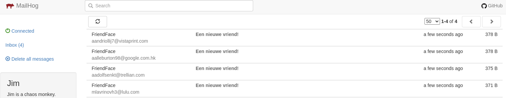

# Verwittigingen versturen
Het is nogal vreemd dat een gebruiker eenzijdig vriendschap kan sluiten. We zullen hier geen volwaardige bevestiging implementeren (dan zou je bijvoorbeeld eerst een tabel `FriendshipRequests` moeten voorzienen een route om die om te zetten naar echte vriendschappen). We zullen er wel voor zorgen dat de persoon waarmee vriendschap gesloten wordt op de hoogte wordt gesteld via e-mail.

Omdat de applicatie momenteel nog niet online staat, is het nog niet mogelijk dit via een echte e-mail server (een "SMTP-server") te doen. Om deze functionaliteit alvast te testen voor we de site online zetten, zullen we de dienst Mailhog toevoegen. Je gebruikt deze dienst zoals je een echte SMTP-server gebruikt en hij biedt een handig overzicht van welke e-mails verstuurd *zouden* zijn in een echte setting. We zullen deze dienst dan aanspreken via `nodemailer`.

