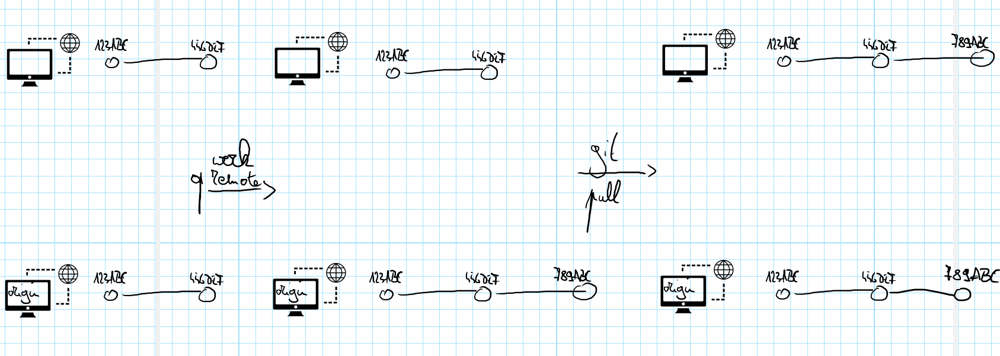

# git pull

Met `git push` stuur je jouw lokale wijzigingen naar een remote. De veronderstelling is dus dat je lokaal werk hebt dat nog niet op de remote bestaat. Het omgekeerde kan ook. Bijvoorbeeld omdat een collega werk op `origin` heeft gezet en jij dat werk wil integreren in jouw code voor je verder gaat.

Dat ziet er dan zo uit:

In eerste instantie vermijden we situaties waarbij we zelf aanpassingen doen en daarna een pull doen. Dat kan ertoe leiden dat je een extra techniek nodig hebt, een `merge`. Die bespreken we op [ergens anders](../lokaal-werken/git-merge.md).
