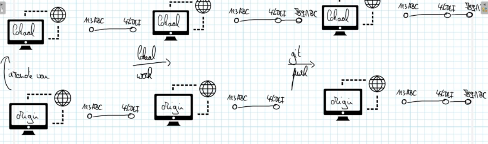
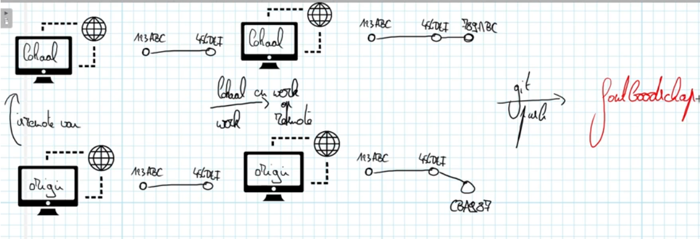

# git push

## Inleiding

Een remote bevat "ongeveer" dezelfde tijdlijn als je lokale repository. Maar remotes worden niet automatisch volledig synchroon gehouden. Dat zou niet gaan, want dat zou problemen leveren als twee mensen tegelijk aan hetzelfde project bezig zouden zijn. In plaats daarvan moet je updates uitdrukkelijk doorsturen naar je remote. Dat doe je met het commando `git push`.

**Deze uitleg veronderstelt dat je schrijfrechten hebt op de remote die je gebruikt. Als je de remote zelf hebt aangemaakt, is dat normaal het geval. Als iemand anders je toegang heeft gegeven, kan het zijn dat dit niet zo is.**

Je kan je dit als volgt voorstellen: vertrek van uit een situatie waarin je lokale bestanden en een remote, bijvoorbeeld `origin`, dezelfde tijdlijn voorstellen. Als je een aanpassing doet en afsluit met een `commit`, wordt je lokale tijdlijn langer, maar dit gebeurt niet vanzelf op `origin`. Om `origin` up-to-date te brengen, moet je het commando `git push` gebruiken. In complexere situaties kan het zijn dat hier extra argumenten aan te pas komen, maar die zijn nu niet aan de orde.

Volgende figuur illustreert wat er gebeurt:

### Wat vermijden we?

We vermijden een push naar een remote waarvan de tijdlijn informatie bevat die niet voorkomt op onze eigen tijdlijn. Dit kan je je als volgt inbeelden:

