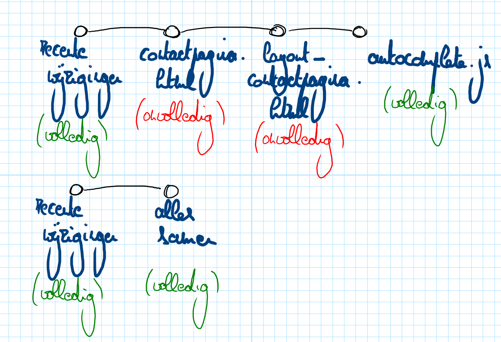

# git add


[Kennisclip](https://ap.cloud.panopto.eu/Panopto/Pages/Viewer.aspx?id=cdfd2107-109b-43d3-b68f-ad9800a304d5)


## Omschrijving van het commando

Het commando `git add` gebruik je om wijzigingen "in potlood" te noteren. Dit doe je zodat je een nieuw punt op je tijdlijn zorgvuldig kan samenstellen voor je het definitief maakt.

Het doet identiek hetzelfde als `git stage`, maar `git add` wordt in de praktijk meer gebruikt. Dat is jammer, want `git stage` is een correctere naam, maar we zullen `git add` gebruiken omdat de meeste bronnen dat doen.

Laat ons nu even kijken naar verdere details met behulp van een voorbeeld.

## Demonstratie

* We hebben een bestaande website en we willen er een contactpagina aan toevoegen. Zoals je misschien al gezien hebt in het vak webtechnologie, betekent dat typisch dat we voor drie soorten code moeten zorgen: HTML-code (min of meer de tekst van je pagina), CSS-code (de layout) en JavaScript (extra interactiviteit, bijvoorbeeld voor het automatisch invullen van delen van het contactformulier). Ik zal nu demonstreren hoe we dat aanpakken voor zo ver het op versiebeheer aankomt. Ik raad aan dat je er de figuur bij neemt met het overzicht van de verschillende [fasen van data](basisbegrippen.md#overzichtsfiguur-opnieuw-opnemen-en-zeggen-hoe-elk-stukje-zich-verhoudt-tot-de-tijdlijn).
* Onderstaande stappen zijn maar één manier waarop je het gewenste resultaat kan bereiken. Bekijk de kennisclip voor meer info.
* We hebben drie files: `contact.html`, `layout_contact.css`, `autocomplete.js`
  * Dit zijn nieuwe files, dus eerst zijn ze allemaal untracked.
  * We zetten ze op de tijdlijn als volgt:
    * `git add contact.html`
    * `git status` (dit verandert niets, maar het staat toe even een controle te doen)
    * kijk terug naar de figuur van eerder: deze file is nu staged
    * `git add --all`
    * `git status`
    * nu zijn alle files staged
      * **nog niets ligt vast in "pen", maar wel in "potlood"**
    * `git commit -m "Contactpagina toegevoegd"` zorgt ervoor dat de tijdlijn wordt aangevuld.

Waarom zetten we verschillende zaken samen in potlood en zetten we niet elke aanpassing meteen in pen op de tijdlijn? Omdat de aanpassingen samenhoren. Zo kunnen we later onze tijdlijn bekijken en in één keer alle wijzigingen bekijken die zorgen voor een bruikbare contactpagina.

Onderstaande figuur (verder uitgelegd in de kennisclip) toont het verschil:

## `git add` tegenover `git stage`

`git add` doet net hetzelfde als `git stage`. Wat je gebruikt is een kwestie van smaak, maar de auteur van deze cursus vindt `git stage` duidelijker. Dat komt omdat dit commando in zekere zin ook zaken kan verwijderen en niet alleen kan toevoegen. Hierover lees je [later](git-rm.md) meer.

| commando             | omschrijving                                       |
| -------------------- | -------------------------------------------------- |
| `git add <filenaam>` | het bestand of de map met naam `<filenaam>` stagen |
| `git add --all`      | alle untracked en modified files stagen            |


Je kan `git add` toepassen op mappen, maar op lege mappen heeft het geen effect. Die kan je niet in versiebeheer plaatsen, maar dat is ook niet erg.

