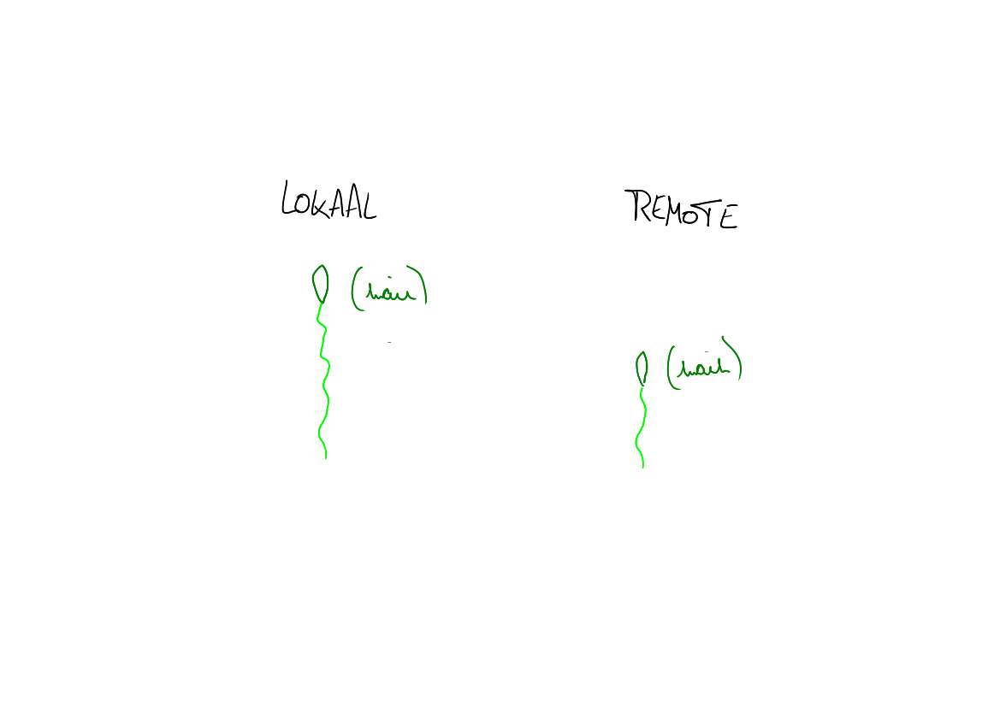

# git branch

## Basisidee 

We hebben het al vaker gehad over "de tijdlijn" van ons project. Eerder hebben we deze ook getekend als een lijn met enkele belangrijke punten op, namelijk de commits.

Maar de projectgeschiedenis zal niet altijd als één rechte lijn groeien. Je ziet ze beter als een rivier met een bron en met vertakkingen die soms terug samen komen. De technische term hiervoor is "directed acyclic graph", soms wel afgekort tot "DAG".

Een voorbeeld: Dylan heeft een mooie website op basis van HTML en CSS, maar wil deze nu interactief maken met behulp van een JavaScript framework. Populaire opties vandaag de dag zijn bijvoorbeeld Angular, React en Vue. Als Dylan nog geen sterke voorkeur heeft, zou hij kunnen beslissen een kleine testversie, een zogenaamd prototype, te maken met _elk_ van de drie frameworks en dan verder te doen met wat hem het meest geschikt lijkt.

Laat ons even bekijken hoe je dit zou aanpakken met de kennis die je al hebt. We starten vanaf de versie met de werkende HTML en CSS en kiezen dan een eerste framework om de extra interactiviteit mee toe te voegen. Voor we beginnen, maken we een commit, zodat we altijd terug kunnen. Dan doen we de aanpassingen in een eerste framework. Laat ons zeggen React. Wanneer we tevreden zijn, committen we. Als we daarna een ander framework willen uitproberen, moeten we met de kennis die we tot nu hebben eerst alles wat met React te maken heeft verwijderen uit de working directory. **** Daarna zouden we Angular kunnen proberen. En dan nog eens alles verwijderen en herbeginnen met Vue. Als we pech hebben, blijkt achteraf dat React of of Angular een betere keuze was. Achteraf zal onze tijdlijn vol staan met werk dat we toch hebben moeten terugdraaien. Je ziet dit op volgende figuur.

Een veel handigere oplossing bestaat erin terug te springen (en hoe we dat doen, zien we later) naar de commit met de werkende HTML en CSS en van daar een tak (in het Engels: branch) in de tijdlijn te maken, bijvoorbeeld voor React. En dat kunnen we later nog eens herhalen voor Angular, Vue en eventuele andere frameworks die we willen uitproberen. We spreken van een "tak" (of "branch") omdat de tijdlijn er al snel als een boom of een rivier gaat uitzien.

Door takken toe te voegen, kunnen we bijvoorbeeld experimenteren met verschillende oplossingen voor een probleem of kunnen collega's tegelijkertijd aan verschillende problemen werken zonder elkaar voor de voeten te lopen. Zo kan bijvoorbeeld één iemand aan de versie met React werken, terwijl iemand anders aan de versie met Angular werkt.

## Technisch 

Het idee van een vertakking lijkt sterk op wat je waarneemt bij planten en rivieren, maar omdat het over software gaat, moeten we wel precies vastleggen wat een tak is. Als we het begrip gewoon overnemen uit het Nederlands, zullen we op misverstanden botsen. Je moet een tak of branch in de meeste situaties eerder zien als "groeiknop".

Een groeiknop is dus zo'n deel van de plant waaruit hout kan ontstaan. Je hebt er een op elk "uiteinde" van de boom, maar er kunnen er ook bijkomen en dat zorgt dan voor een splitsing in het hout. Voor ons is het "hout" is onze code. Elke keer we code toevoegen, d.w.z. committen, wordt de knop vooruit geduwd.

We kunnen op elk moment branches, dus groeiknoppen, toevoegen op de huidige commit. Dat doen we met het commando `git branch <naam van de nieuwe tak>`. Wat er daarna gebeurt, is heel abstract als je het enkel in woorden uitlegt, dus we leggen het uit aan de hand van een reeks tekeningen:


Reeks van 9 slides. Elke slide stemt overeen met een genummerd puntje hieronder.


1. elke nieuwe repository begint zonder tijdlijn
2. de eerste commit gebeurt op de defaulttak, normaal `main.` `main` is dus de naam van de groeiknop die hier als het ware uit de grond verschijnt
3. naarmate we commits toevoegen, groeit het plantje, maar er is nog altijd maar één groeiknop, totdat we een mooie versie hebben met enkel HTML en CSS. Die versie is waar nu `main` staat.
4. om React uit te proberen, maken we een extra groeiknop, dus een branch, die vertrekt vanaf het punt met enkel HTML en CSS
5. naarmate we React code toevoegen, verplaatst deze groeiknop zich. Het is alsof hij vooruit geduwd wordt omdat er hout bijkomt. Voor ons is het geen hout, maar code die gecommit wordt.
6. wanneer we Angular willen uitproberen, maken we terug een extra branch vanaf het punt met enkel HTML en CSS
7. ook deze tak groeit naarmate we code toevoegen
8. wanneer we ten slotte Vue willen proberen, maken we _nog_ een extra branch vanaf het punt met enkel HTML en CSS
9. ook deze groeit wanneer we committen

Meestal zit je dus goed als je een branch ziet als een naam voor een groeiknop. Dat is duidelijker dan wat we op een echte boom in het Nederlands zouden aanduiden als "een tak". **Technisch** is een tak eigenlijk een naam voor een commit die wordt "doorgegeven" wanneer we een verdere commit doen vanaf die tak. Met andere woorden, iets als `main` wijst naar een bepaalde commit, maar kan in de toekomst naar een andere commit wijzen. Een vaste naam voor een bepaalde commit heb je al met de commit hash.

Eén puntje om voor op te letten: soms zeggen ontwikkelaars aan collega's dat een bepaald stuk code "op een bepaalde tak" staat. Bijvoorbeeld Dylan van eerder zou kunnen zeggen: "Die code staat op de branch `angular`". Dan bedoelt hij niet noodzakelijk "in de commit waar `angular` momenteel naar verwijst". Eigenlijk bedoelt hij: "Vertrek vanaf de commit met die naam, ga van daar terug naar een splitsing. Kijk even naar de figuur hieronder. Als je vanaf `angular` teruggaat naar de splitsing met `main`, passeer je vijf commits (de vijfde is de groeiknop). Ergens in die vijf commits vind de code waarover Dylan het heeft.

## Commando's 

Er zijn enkele commando's in verband met `git branch` die je zeker zal nodig hebben:

* ten eerste is er `git branch <naam>`. Dit creëert een nieuwe branch, dus een groeiknop, vanop de commit waar we nu zitten.
* ten tweede heb je `git branch -D <naam>`: dit commando "snoeit" het gedeelte dat enkel leidt tot aan die knop. Zie iets lager voor een illustratie.
* het commando `git branch` zonder meer geeft je ten slotte de namen van al je takken
* ten slotte, als we `git log --graph --all` gebruiken, zien we een weergave van onze projectgeschiedenis met alle vertakkingen, eerder dan alleen de commits waarvan de huidige commit afstamt

 

## Overeenkomstige branches 

Het idee van een plant met vertakkingen werkt goed om uit te leggen wat er lokaal gebeurt, d.w.z. als we één projectgeschiedenis hebben, maar we weten al dat er verschillende (laat ons zeggen) bijna-kopieën van onze projectgeschiedenis kunnen zijn waarmee we regelmatig afstemmen. Daarmee bedoelen we: de remotes. Elke remote is een repository op zich, dus je beschouwt een remote best als een extra plant. We zullen hier voor het gemak spreken over `origin`.

Als je lokaal werk hebt verricht, wil je dit vaak ook zichtbaar maken op `origin`. Dat is bijvoorbeeld nodig als je je code wil delen met anderen in je team. Dat houdt dus eigenlijk in dat je aangeeft hoe de "plant" `origin` verder moet groeien. Als je bijvoorbeeld alleen een tak `main` hebt en twee commits voorligt op `origin` en `git push` uitvoert, zeg je eigenlijk: "verleng" de tak `main` op origin (en daar verwijzen we naar als `origin/main`) nu met deze twee commits, zodat de route van `origin/main` naar de initial commit er hetzelfde uitziet als voor mijn lokale repository. Dit zie je op de figuren onder deze paragraaf. We noemen onze lokale `main` om die reden de "tracking branch" van `origin/main`. Dit betekent dat `push` code van de lokale `main`naar `origin/main` stuurt en dat `pull` code van `origin/main` afhaalt naar de lokale `main`.

 

Niet alleen `main` kan een tracking branch zijn. Je kan namelijk ook zeggen dat andere takken, bijvoorbeeld `voorbeeldbranch`, weerspiegeld moeten worden op `origin`. Dat zou je dan doen door uitdrukkelijk die tak te `pushen`, via `git push origin voorbeeldbranch`. Dit zorgt er bijvoorbeeld voor dat je collega's ook je voorlopig werk kunnen bekijken. Zie figuren hieronder.

 

## Conclusie 

Je hebt nu een beeld van waar branches voor dienen en hoe je ze aanmaakt. Verder in de cursus zullen we bekijken hoe je wisselt tussen takken.
