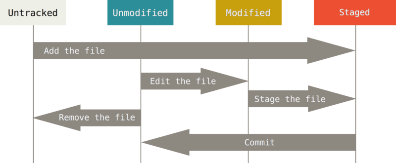

# git status


[Kennisclip](https://ap.cloud.panopto.eu/Panopto/Pages/Viewer.aspx?id=17812281-95e5-4253-9aae-ad9e009c82fb)


## Betekenis

We hebben het commando `git status` al een paar keer gebruikt. Het vertelt ons welke gegevens zich in welke toestand bevinden met betrekking tot deze figuur:

De output van `git status` verwoordt sommige zaken een beetje anders, dus je moet weten hoe je hem moet aflezen.

We weten al dat een gloednieuwe file onder "untracked" valt, dus als we een nieuwe file maken, staat die in de output onder "untracked files". Dit is in de veronderstelling dat de file niet vermeld wordt in `.gitignore`. In dat laatste geval wordt hij gewoon niet getoond.

Vlak na een commit, verschijnt een file niet. Unmodified files worden dus niet getoond.

Files in de "modified" toestand worden vermeld onder "Changes not staged for commit". Ze zijn dus nog niet genoteerd in potlood, maar je krijgt ook hints over wat je daar aan kan doen.

"Staged" files staan onder "Changes to be committed". "to be ..." drukt uit dat iets gepland staat. Met andere woorden, deze zaken staan al in potlood. Er staat ook bij hoe we kunnen **unstagen**. Let op: dat maakt de wijzigingen zelf niet ongedaan, maar wist alleen hetgene we genoteerd hebben "in potlood".

## Opmerkingen

### `-u`

We raden aan de optie `-u` te gebruiken met dit commando. Als de inhoud van een map untracked is en je gebruikt de optie **niet**, wordt gewoon de naam van die map getoond. Niet de individuele bestanden. Dat is korter, maar niet zo specifiek. `-u` geeft je een beter zicht op je bestanden, waardoor je bijvoorbeeld `.gitignore` nauwkeuriger kan invullen.

### Altijd volledige files?

Het commando toont filenamen, maar eigenlijk gaat het om data in files. Dit kan je nagaan door een file te stagen en dan aan te passen zonder commit. Dan vind je hem terug onder "changes not staged for commit" **en** onder "changes to be committed". Strikt gesproken hebben we het dus over de aanpassingen aan een file en niet over heel de file: een hele file kan niet tegelijkertijd modified en staged zijn, maar een deel ervan kan wel modified zijn en een ander deel kan staged zijn.

## Boodschap van algemeen nut

Gebruik, zeker wanneer je pas met Git leert werken, voor en na elke commit `git status -u`. Controleer daarbij steeds of verwachtingen overeenstemmen met de uitvoer en met de referentiefiguur. Dat zal je heel wat kopzorgen besparen en je traint er meteen je kennis van Git grondig mee.

| commando        | omschrijving                                                                                                       |
| --------------- | ------------------------------------------------------------------------------------------------------------------ |
| `git status`    | vertel welke data untracked, modified of staged is en toon directories waarin elke file untracked is als één regel |
| `git status -u` | hetzelfde, maar toon elke untracked file altijd op een eigen regel                                                 |
