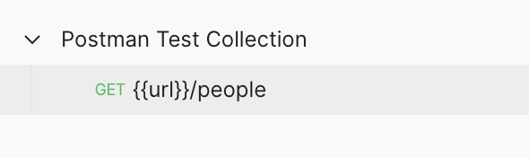

# SSH-sleutelpaar aan een server toevoegen

## Inloggegevens voor een op wachtwoord gebaseerde SSH-toegang

Om je publieke sleutel naar een server te kunnen kopiëren moet je natuurlijk toegang hebben tot een server. Voor deze zelfstudie zal je werken met een op wachtwoord gebaseerde SSH-toegang tot een server.

Je lector zal inloggegevens voorzien waarmee je via een `username`, `password` en `hostname` kunt inloggen. Het is vervolgens de bedoeling om de gegenereerde sleutelparen, die je in de vorige stap hebt aangemaakt, te kopiëren naar de server zodat je **zonder wachtwoord** kan authenticeren.

### Uploaden van een SSH-sleutelpaar

1\) Eenmaal als je de inloggegevens hebt ontvangen van de lector mag je het volgende commando uitvoeren in je terminal:

```bash
cat ~/.ssh/id_rsa.pub | ssh username@remote_host "mkdir -p ~/.ssh && cat >> ~/.ssh/authorized_keys"
```


Vervang `username` en `hostname` in het bovenstaande commando met jou persoonlijke inloggegevens.&#x20;



Het commando zal verbinding maken met de server en in de root folder een `/.ssh` folder aanmaken met daarin een bestand `authorized_keys`. Vervolgens zal het de public key, die lokaal op je computer staat, kopiëren naar het nieuwe bestand.


2\) Het kan zijn dat je het onderstaande bericht krijgt. Typ 'yes' en druk op enter.

<figure><figcaption></figcaption></figure>

3\) Typ het paswoord in dat je van je lector hebt gekregen.

<figure><figcaption></figcaption></figure>


Na het invoeren van het paswoord wordt je sleutel gekopieerd, zodat je zonder paswoord kunt inloggen.


4\) Om te controleren of je sleutel correct is ingesteld, probeer je via SSH toegang te krijgen tot de server met behulp van de volgende opdracht:

```bash
ssh username@hostname
```


Vervang `username` en `hostname` in het bovenstaande commando met jou persoonlijke inloggegevens.

Indien je tijdens het genereren van je sleutelpaar een passphrase hebt ingesteld zal je deze natuurlijk  bij elke nieuwe verbinding moeten invullen.


Je sleutelpaar werkt indien je het onderstaande bericht te zien krijgt!

<figure><figcaption></figcaption></figure>

Proficiat! :tada: In de volgende stap zal je leren hoe je mappen, bestanden en uiteindelijk een volledige website aan de server kunt toevoegen.
