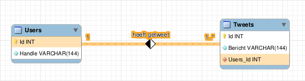

# 1-op-1 en 1-op-N relaties

Afhankelijk van hoe entiteiten aan elkaar gekoppeld kunnen zijn, worden relaties ingedeeld in drie categorieën:

* een-op-een-relaties, d.w.z. één entiteit van een entiteittype hoort bij exact één entiteit van een gekoppeld type
* een-op-veel-relaties, d.w.z. één entiteit van een entiteittype hoort niet bij 0, 1 of meerdere entiteiten van een gekoppeld type
* veel-op-veel-relaties (ook wel M-op-N relaties genoemd)


Er is nog een indeling in relaties: identificerende tegenover niet-identificerende relaties. Dit onderscheid heeft niet veel impact op het basisgebruik van een databank. Met de werkwijze die wij volgen, kan je steeds niet-identificerende relaties gebruiken, tenzij het om veel-op-veel relaties gaat.


### een-op-een relaties

De simpelste verbanden zijn één-op-één verbanden. Dat wil zeggen: precies twee rijen nemen deel aan de relatie. Normaal zijn dit rijen van verschillende entiteittypes, al is het niet verplicht.

Een voorbeeld: een sportclub organiseert een jaarlijks etentje en alle leden krijgen precies één taak. Eén lid zorgt bijvoorbeeld voor bestek, een ander voor frisdrank, een ander voor onderleggers, enzovoort. De club gebruikt een database om de taken en de leden bij te houden en de taken zijn elk jaar dezelfde. Bijvoorbeeld:

* taken:
  * bestek voorzien
  * frisdrank meebrengen
  * aardappelsla maken
* leden:
  * Yannick
  * Bavo
  * Max

Onderstaande figuur stelt deze indeling voor in een "entity relationship diagram" getekend in de editor van MySQL Workbench:


In dit geval is het logisch om een aparte tabel (`Taken`) voor taken en een aparte tabel (`Leden`) voor leden te gebruiken. Het is onhandig om uit te leggen dat één rij in de databank een lid _en_ een taak voorstelt, omdat de tabellen best zo goed mogelijk overeenstemmen met duidelijke concepten. Het is logischer de leden en de taken als aparte entiteiten te beschouwen en een relatie tussen beide vast te leggen.


Er zijn wel systemen die je dwingen om dit soort relatie voor te stellen door Taken en Personen samen te smelten tot één tabel.


#### voorstelling van één-op-één relaties

Om een relaties tussen rijen van de tabellen vast te leggen, maken we de rijen eerst identificeerbaar met een primaire sleutel. Bijvoorbeeld, voor de taken:

| Omschrijving         | Id |
| -------------------- | -- |
| bestek voorzien      | 1  |
| frisdrank meebrengen | 2  |
| aardappelsla maken   | 3  |

Voor de leden:

| Naam    | Id |
| ------- | -- |
| Yannick | 1  |
| Bavo    | 2  |
| Max     | 3  |

Als Bavo bestek voorziet, Yannick frisdrank meebrengt en Max aardappelsla maakt, kunnen we dat als volgt bijhouden in een aparte tabel die alleen vreemde sleutels bevat:

| Leden\_Id | Taken\_Id |
| --------- | --------- |
| 2         | 1         |
| 1         | 2         |
| 3         | 3         |

In de praktijk wordt er normaal niet voor gekozen om deze relatie in een aparte tabel vast te leggen. Er is geen aparte tabel nodig. Eén van de twee tabellen wordt uitgebreid met een foreign key. Er zijn twee mogelijkheden:

| Omschrijving         | Id | Leden\_Id |
| -------------------- | -- | --------- |
| bestek voorzien      | 1  | 2         |
| frisdrank meebrengen | 2  | 1         |
| aardappelsla maken   | 3  | 3         |

of

| Naam    | Id | Taken\_Id |
| ------- | -- | --------- |
| Yannick | 1  | 2         |
| Bavo    | 2  | 1         |
| Max     | 3  | 3         |

Beide zijn even goed. Typisch wordt gekozen om de foreign key in de tabel te zetten met het kleinste aantal kolommen, om alles in evenwicht te houden. Hier hebben beide even veel kolommen. Het maakt dus niet uit.

De data kunnen nu terug gecombineerd worden, maar dat vereist een `JOIN`-operatie. Die wordt elders besproken.

### een-op-veel relaties

Een een-op-veel (of 1-op-N) verband is een verband dat heel vaak voorkomt. Bij dit soort verband stemt een rij uit een bepaalde tabel A overeen met meerdere rijen uit een tabel B. In de omgekeerde richting stemt een rij uit tabel B maar met één rij van tabel A overeen. Bijvoorbeeld, als je tweets bijhoudt in een databank, kan één persoon meerdere tweets hebben, maar één tweet kan oorspronkelijk slechts van één persoon komen. Hier moet je je inbeelden dat personen bijgehouden worden in tabel A en tweets in tabel B. In een database van een webshop kan één persoon meerdere bestellingen plaatsen, maar één bestelling kan slechts van één klant komen. Hier geldt: personen in A, bestellingen in B.

Hier zijn enkele voorbeeldtweets, voorafgegaan door de handle van de gebruiker die ze geschreven heeft:

```
@NintendoEurope: Don't forget -- Nintendo Labo: VR Kit launches 12/04!
@NintendoEurope: Splat it out in the #Splatoon2 EU Community Cup 5 this Sunday!
@NintendoEurope: Crikey! Keep an eye out for cardboard crocs and other crafty wildlife on this jungle train ride! #Yoshi
@Xbox: You had a lot to say about #MetroExodus. Check out our favorite 5-word reviews.
@Xbox: It's a perfect day for some mayhem.
@Xbox: Drift all over N. Sanity Beach and beyond in Crash Team Racing Nitro-Fueled.
```

Zoals in het geval van de 1-op-1 relatie, kan deze relatie weergegeven worden als tabel:

| user | tweet |
| ---- | ----- |
| 1    | 1     |
| 1    | 2     |
| 1    | 3     |
| 2    | 4     |
| 2    | 5     |
| 2    | 6     |

Dit gebruikt opnieuw meer opslagruimte dan nodig. We kunnen een foreign key om naar één tabel te verwijzen toevoegen aan de andere tabel. Maar, in tegenstelling tot de precieze 1-op-1-relatie, is de keuze hier niet vrij. De foreign key hoort thuis in de tabel die **niet aan de "exact-1"-kant** van de relatie zit.



#### speciaal geval: een-op-max-een-relaties

Een een-op-max-een relatie is een relatie waarbij één entiteit A gelinkt is aan **hooguit** één andere entiteit B. Het kan ook zijn dat A aan geen enkele B gelinkt is. Deze stel je voor zoals een 1-op-N relatie, dus met de vreemde sleutel in de tabel aan de niet-exact-1-kant.
