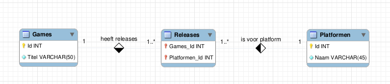
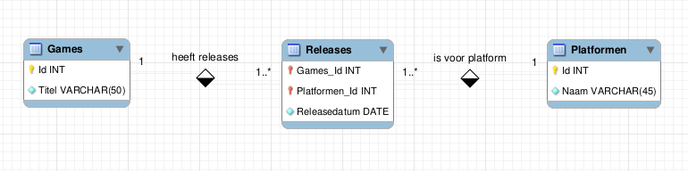

# N-op-M / veel-op-veel relaties

Een auteur kan meerdere boeken hebben en een boek kan verschillende auteurs hebben. Een game kan op verschillende platformen uitgebracht zijn en voor elk platform zijn er verschillende games beschikbaar. Een student volgt verschillende vakken en in elk vak zitten verschillende studenten. Dit zijn allemaal voorbeelden waar één rij uit een tabel A gekoppeld kan zijn aan meerdere rijen uit een tabel B en één rij uit dezelfde tabel B gekoppeld kan zijn aan meerdere rijen uit dezelfde tabel A. We zeggen dan ook dat er een veel-op-veel of N-op-M-relatie (of M-op-N-relatie, beide letters stellen gewoon een variabel getal voor) bestaat tussen de entiteiten A en B.

Bij 1-op-1-relaties mag je de vreemde sleutel in tabel A of B zetten. Bij 1-op-max-1 of 1-op-N relaties zet je de vreemde sleutel in de tabel die niet precies één keer gekoppeld is. Dit is om geen overbodige tabellen toe te voegen. In principe is het wel _mogelijk_ om een koppeling in een aparte tabel bij te houden:

| Leden\_Id | Taken\_Id |
| --------- | --------- |
| 2         | 1         |
| 1         | 2         |
| 3         | 3         |

Deze extra tabel kan in het geval van een 1-op-veel-relatie vermeden worden door de foreign key aan de "veel"-kant van de relatie te plaatsen. Voor een N-op-M-relatie is deze voorstelling echter de enige optie.

#### voorbeeld

Een game kan beschikbaar zijn op meerdere platformen en op elk platform zijn er natuurlijk meerdere games beschikbaar. Bijvoorbeeld:

* Anthem: beschikbaar op PS4, XBox One, Windows
* Sekiro: beschikbaar op PS4, XBox One, Windows
* Devil May Cry 5: beschikbaar op PS4, XBox One
* Mega Man 11: beschikbaar op PS4, XBox One, Windows, Nintendo Switch

Veronderstel dat Anthem ID 1 heeft, Sekiro 2, enzovoort. Veronderstel ook dat PS4 ID 1 heeft, Xbox One ID 2, Windows ID 3 en Nintendo Switch ID 4. Dit kan als volgt voorgesteld worden:

| Games\_Id | Platformen\_Id |
| --------- | -------------- |
| 1         | 1              |
| 1         | 2              |
| 1         | 3              |
| 2         | 1              |
| 2         | 2              |
| 2         | 3              |
| 3         | 1              |
| 3         | 2              |
| 4         | 1              |
| 4         | 2              |
| 4         | 3              |
| 4         | 4              |

Hier zijn drie tabellen nodig: een voor games, een voor platformen, een voor de koppeling. De tabel `Games` heeft naast de `Id` nog kolommen, bijvoorbeeld `Titel`, die specifiek over de game gaan. Voor `Platformen` is er een gelijkaardige structuur en informatie over het platform (zoals `Naam`) staat in die tabel. De tabel die de koppeling afhandelt kan je een generieke naam geven zoals `Games_Platformen` of een naam met meer semantiek, zoals `Releases`.

Je zou bijvoorbeeld volgende voorstelling kunnen hanteren:

```sql
CREATE TABLE Platformen(
  Naam varchar(50) NOT NULL,
  Id INT AUTO_INCREMENT PRIMARY KEY
);
CREATE TABLE Games(
  Titel varchar(50) NOT NULL,
  Id int auto_increment PRIMARY KEY
);
CREATE TABLE Releases(
  Games_Id INT NOT NULL,
  Platformen_Id INT NOT NULL,
  CONSTRAINT fk_Releases_Games FOREIGN KEY (Games_Id) REFERENCES Games(Id),
  CONSTRAINT fk_Releases_Platformen FOREIGN KEY (Platformen_Id) REFERENCES Platformen(Id)
);
```

Als er maar één `Release` per combinatie mogelijk is, kan je de combinatie van de foreign keys van de andere tabellen gebruiken als primary key van `Releases`. Dit wordt dan:

```sql
CREATE TABLE Platformen(
  Naam varchar(50) NOT NULL,
  Id INT AUTO_INCREMENT PRIMARY KEY
);
CREATE TABLE Games(
  Titel varchar(50) NOT NULL,
  Id int auto_increment PRIMARY KEY
);
CREATE TABLE Releases(
  Games_Id INT NOT NULL,
  Platformen_Id INT NOT NULL,
  CONSTRAINT fk_Releases_Games FOREIGN KEY (Games_Id) REFERENCES Games(Id),
  CONSTRAINT fk_Releases_Platformen FOREIGN KEY (Platformen_Id) REFERENCES Platformen(Id),
  PRIMARY KEY (Games_Id, Platformen_Id)
);
```

Dit stemt overeen met een diagram in Workbench dat er zo uitziet:



Je zou dan games kunnen koppelen aan platformen als volgt:

```sql
INSERT INTO Platformen(Naam)
VALUES
('PS4'),
('Xbox One'),
('Windows'),
('Nintendo Switch');
INSERT INTO Games(Titel)
Values
('Anthem'),
('Sekiro: Shadows Die Twice'),
('Devil May Cry 5'),
('Mega Man 11');
-- Dit is het basisprincipe, er zijn gevorderde manieren om hier met de titels te werken.
INSERT INTO Releases(Games_Id,Platformen_Id)
values
(1,1),
(1,2),
(1,3),
(2,1),
(2,2),
(2,3),
(3,1),
(3,2),
(4,1),
(4,2),
(4,3),
(4,4);
```

## Relaties met attributen

Attributen horen meestal bij entiteiten, maar kunnen ook bij relaties horen. Bovenstaande tabel `Releases` geeft bijvoorbeeld aan welk spel op welk platform verschenen is, maar wat als we de releasedatum willen bijhouden? Deze past niet in de tabel `Games`, want hij kan variëren per platform waarop de game is uitgekomen. Het is dus technisch niet eens mogelijk, want dat zou één extra kolom per ondersteund platform vereisen. Hetzelfde technische argument verklaart waarom hij niet in `Platformen` hoort.

De releasedatum hoort bij **de combinatie van een game en een platform**, d.w.z. bij de relatie die wordt voorgesteld met de tabel `Releases`. Daarom moet deze tabel uitgebreid worden met een kolom `Releasedatum`. Voor het leesgemak stellen we de games en de platformen niet voor via hun `Id`-attribuut, maar ze worden wel zo voorgesteld.

| Titel                     | Naam            | Releasedatum     |
| ------------------------- | --------------- | ---------------- |
| Anthem                    | PS4             | 22 februari 2019 |
| Anthem                    | XBox One        | 22 februari 2019 |
| Anthem                    | Windows         | 22 februari 2019 |
| Sekiro: Shadows Die Twice | PS4             | 22 maart 2019    |
| Sekiro: Shadows Die Twice | XBox One        | 22 maart 2019    |
| Sekiro: Shadows Die Twice | Windows         | 22 maart 2019    |
| Devil May Cry 5           | PS4             | 8 maart 2019     |
| Devil May Cry 5           | XBox One        | 8 maart 2019     |
| Mega Man 11               | PS4             | 2 oktober 2018   |
| Mega Man 11               | XBox One        | 2 oktober 2018   |
| Mega Man 11               | Windows         | 2 oktober 2018   |
| Mega Man 11               | Nintendo Switch | 2 oktober 2018   |

In een ERD stellen we dit als volgt voor:



In dit geval is `Releases` niet gewoon een tabel die een **relatie** voorstelt, maar wel een **associative entity**: een relatie tussen `Games` en `Platformen` die eigen kenmerken bezit, zodat je ze eigenlijk ook als een entiteit zou kunnen zien.

## Verdere soorten relaties

Tabellen kunnen meer dan twee entiteiten verbinden. Voor releases van games kan je bijvoorbeeld een spel, een uitgever en een platform aan elkaar linken met een M-op-N-op-K relatie. Dit is bijna nooit nodig en kan opgesplitst worden in meerdere, kleinere verbanden.
