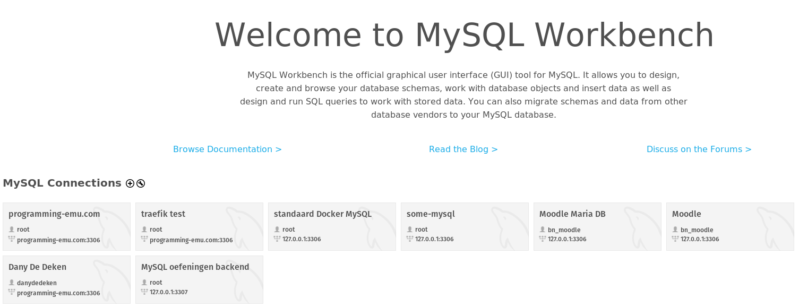
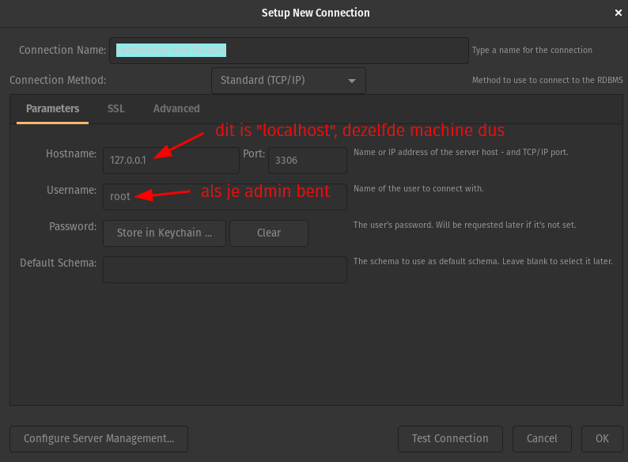

# Installatie MySQL Workbench

Download: [https://dev.mysql.com/downloads/workbench/](https://dev.mysql.com/downloads/workbench/)


installatie MySQL Workbench


## Login

Basisscherm MySQL Workbench:

<figure><figcaption>Startscherm MySQL Workbench</figcaption></figure>

**Stap 1:** Klik op het plusje.

**Stap 2:** Vul de juiste gegevens in.

<figure><figcaption>Connectiegegevens. Deze kunnen anders zijn naargelang de situatie.</figcaption></figure>

Je klikt na het invullen van de juiste gegevens op de knop "**Store in Keychain**" en vult het paswoord voor de ingevulde gebruiker in.

**Stap 3:** Connectie testen.

Je moet volgende boodschap krijgen.

