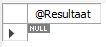
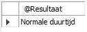
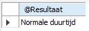

# Control flow
Controlflowmechanismen dienen om de uitvoering van een stored program te sturen.
Je kan ze gebruiken in stored programs, stored functions en triggers om bepaalde
code al dan niet herhaald uit te voeren afhankelijk van bepaalde factoren.

## IF-THEN-ELSE-ELSEIF
Op basis van het resultaat van een IF-THEN-... statement kan je één of meerdere SQL statements uitvoeren en een aangepast resultaat op basis van de ingebouwde conditie weergeven.

### IF-THEN

De basissyntax is als volgt:

```sql
IF conditie THEN 
  statement(s);
END IF;
```

Toegepast op de voobeelddatabase voor stored procedures, meerbepaald op de tabel `Liedjes`.

```sql
DELIMITER $$

CREATE DEFINER=`root`@`localhost` PROCEDURE `ifThen`(
  IN pLiedjesId INT,
  OUT pResult VARCHAR(30)
)
BEGIN
  DECLARE songLength INT;
  SELECT Lengte 
  INTO songLength
  FROM Liedjes
  WHERE Id = pLiedjesId;
  IF songLength > 300 THEN
    SET pResult = 'Lange duurtijd';
  END IF;
END$$

DELIMITER ;
```

In bovenstaand voorbeeld creëren we een `IN` en `OUT` parameter voor de stored procedure `ifThen`. Het inputargument `pLiedjesId` wordt gebruikt om het Id van het liedje op te geven. Het outputargument `pResult` wordt dan weer gebruikt om een waarde weer te geven buiten de stored procedure.

Het sql-statement gaat de lengte van het liedje met het `Id` dat bepaald is door de `IN`-parameter `pLiedjesId` bewaren in de lokale variabele `songLength`.

Vervolgens wordt op basis van een `IF-THEN` constructie nagegaan wat de inhoud van de lokale variabele `songLength` is. In geval deze groter is dan 300, krijgt het output argument de waarde 'Lange duurtijd'.

Om de stored procedure op te roepen, hanteren we volgend statement.

```sql
CALL ifThen(2716, @Resultaat);
SELECT @Resultaat;
```

Het resultaat is:

.JPG>)

Als je evenwel een id zou opgeven waarvoor de duurtijd korter is dan 300, dan wordt er niets weergegeven.



Voor een resultaat van de vorm "Korte duurtijd" of misschien ook "Middelmatige duurtijd" zou je met [`IF-THEN-ELSE`](if-then.md#if-then-else) of met [`IF-THEN-ELSEIF-ELSE`](if-then.md#if-then-elseif-else) werken, zie verder.

## IF-THEN-ELSE

De syntax is:

```sql
IF conditie THEN
 statement(s);
ELSE
 statement(s);
END IF;
```

De procedure omschreven in het voorgaande deel [`IF-THEN`](if-then.md#if-then) wordt uitgebreid: wanneer de duurtijd meer dan 300 seconden bedraagt, wordt weergegeven dat het een lange duurtijd betreft. In het andere geval wordt "Normale duurtijd" weergegeven.

Onderstaand voorbeeld laat zien hoe de IF-THEN-ELSE moet worden voorzien.

```sql
DELIMITER $$

CREATE DEFINER=`root`@`localhost` PROCEDURE `ifThenElse`(
  IN pLiedjesId INT,
  OUT pResult VARCHAR(30)
)
BEGIN
  DECLARE songLength INT;
  SELECT Lengte 
  INTO songLength
  FROM Liedjes
  WHERE Id = pLiedjesId;
  IF songLength > 300
  THEN
    SET pResult = 'Lange duurtijd';
  ELSE
    SET pResult = 'Normale duurtijd';
  END IF;
END$$

DELIMITER ;
```

Hieronder het resultaat voor een liedje met een lengte van minder dan 300 sec.

```sql
CALL ifThenElse(1, @Resultaat);
SELECT @Resultaat;
```



In het geval dat de waarde groter is dan 300 sec., dan bekom je hetzelfde resultaat als bij het onderdeel [`IF-THEN`](if-then.md#if-then) hierboven.

## IF-THEN-ELSEIF-ELSE

De syntax is hier:

```sql
IF conditie THEN
   if-statement(s);
ELSEIF conditie THEN
   elseif-statement(s);
ELSE
   else-statement(s);
END IF;
```

Merk op dat `ELSEIF` in MySQL aan elkaar wordt geschreven!

De procedure omschreven in het voorgaande deel [`IF-THEN-ELSE`](if-then.md) wordt uitgebreid. We voorzien nu dat wanneer de duurtijd meer dan 300 seconden bedraagt, er wordt weergegeven dat het een lange duurtijd betreft. In het geval de duurtijd tussen de 180 en 300 ligt wordt is de duurtijd normaal. In het geval deze minder dan 180 bedraagt, is hij kort.

Onderstaand voorbeeld laat zien hoe de IF-THEN-ELSEIF-ELSE moet worden voorzien.

```sql
DELIMITER $$

CREATE DEFINER=`root`@`localhost` PROCEDURE `ifThenElseifElse`(
  IN pLiedjesId INT,
  OUT pResult VARCHAR(30)
)
BEGIN
  DECLARE songLength INT;
  SELECT Lengte 
  INTO songLength
  FROM Liedjes
  WHERE Id = pLiedjesId;
  IF songLength > 300
  THEN
    SET pResult = 'Lange duurtijd';
  ELSEIF songLength >= 180
    SET pResult = 'Normale duurtijd';
  ELSE
    SET pResult = 'Korte duurtijd';
  END IF;
END$$

DELIMITER ;
```

Hieronder het resultaat voor een id met een lengte van meer dan 180 sec. en minder dan 300 sec.

```sql
CALL if_then_elseif_else(15, @Resultaat);
SELECT @Resultaat;
```




## WHILE

`WHILE` is ook een herhalingsstructuur die zorgt dat code of statements achter elkaar kunnen uitgevoerd worden zolang de conditie waar (`TRUE`) is.

De syntax is:

```sql
WHILE [conditie] DO
  statement(s)
END WHILE 
```

De `WHILE`-lus is controleert de conditie voordat het statement wordt uitgevoerd.

Onderstaand schema illustreert dit principe.


Om het principe van de `WHILE`-lus te tonen, maken we eerst een nieuwe tabel `TimeSlots` aan. Deze stelt alle tijdstippen op een kalender voor.

```sql
CREATE TABLE TimeSlots(
  Id INT AUTO_INCREMENT PRIMARY KEY,
  SlotDate DATE UNIQUE
);
```

Vervolgens zorgen we via een nieuwe stored procedure `AddTimeSlots` dat de zojuist gecreëerde tabel wordt gevuld met data beginnende vanaf een datum.

```sql
DELIMITER $$
USE `aptunes`$$
CREATE DEFINER=`root`@`localhost` PROCEDURE `AddTimeSlots`(
    startDate DATE,
    numberOfDays INT
)
BEGIN
    DECLARE counter INT DEFAULT 1;
    DECLARE currentDate DATE DEFAULT startDate;
    WHILE counter <= numberOfDays DO
        INSERT INTO TimeSlots (SlotDate)
        VALUES
        (currentDate);
        SET counter = counter + 1;
        -- deze functie telt een aantal dagen bij een datum
        SET currentDate = DATE_ADD(currentDate, INTERVAL 1 day);
    END WHILE;
END$$

DELIMITER ;
```

In bovenstaande stored procedure gebruiken we de `WHILE`-lus.

Zolang de teller kleiner of gelijk is aan het opgegeven aantal dagen, dan zullen data worden toegevoegd aan de gecreëerde tabel `TimeSlots`.

```sql
CALL AddTimeSlots('2020-04-19', 90);
```

Deze uitvoering van de stored procedure `AddTimeSlots` geeft volgend resultaat:

<figure><figcaption></figcaption></figure>

# REPEAT

De `REPEAT` herhalingsstructuur voert code of statements achter elkaar uit tot de conditie waar (`TRUE`) is.

**Syntax**

```sql
REPEAT
    statement(s)
UNTIL [conditie]
END REPEAT
```

De `REPEAT` herhalingsstructuur controleert of de conditie waar (`TRUE`) is na de uitvoering van de statement(s). De gedefinieerde statement(s) worden dus in alle gevallen steeds minstens één keer uitgevoerd. Dit stemt overeen met het gedrag van een `do ... while` in typische programmeertalen. Let wel op: een `do ... while` blijft herhalen **zo lang** iets waar is, een `REPEAT ... UNTIL` herhaalt **tot** iets waar is. Ze zijn evenwaardig, maar de voorwaarde wordt op een omgekeerde manier aangegeven.

Het schema hieronder geeft dit duidelijk weer.


Het principe van de `REPEAT` herhalingsstructuur wordt toegelicht aan de hand van onderstaande stored procedure waarbij nummers van 1 tot 25 worden geconcateneerd (aan elkaar geplakt).

```sql
USE `aptunes`;
DROP procedure IF EXISTS `ConcatenateNumbersViaRepeat`;

DELIMITER $$
USE `aptunes`$$
CREATE DEFINER=`root`@`localhost` PROCEDURE `ConcatenateNumbersViaRepeat`()
BEGIN
    DECLARE counter INT DEFAULT 1;
    DECLARE result VARCHAR(90) DEFAULT '';

    REPEAT
        SET result = CONCAT(result,counter,',');
        SET counter = counter + 1;
    UNTIL counter >= 25
    END REPEAT;
    set result = CONCAT(result, counter);

    -- toont het resultaat op het scherm
    SELECT result;
END$$

DELIMITER ;
```

Kort uitgelegd:

* Er worden twee variabelen gedeclareerd, nl. teller en resultaat.
* Zolang de teller niet groter of gelijk is aan 25 worden de statements waarbij de `CONCAT`-functie wordt gebruikt uitgevoerd.
