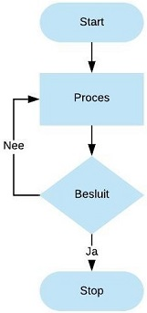
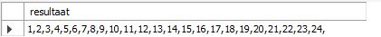

# IF -THEN-ELSE-ELSEIF

Drie mogelijkheden:

* [IF-THEN](if-then.md#if-then)
* [IF-THEN-ELSE](if-then.md#if-then-else)
* [IF-THEN-ELSEIF-ELSE](if-then.md#if-then-elseif-else)

Op basis van het resultaat van een IF-THEN-... statement kan je één of meerdere SQL statements uitvoeren en een aangepast resultaat op basis van de ingebouwde conditie weergeven.

## IF-THEN

**Syntax:**

```sql
IF conditie THEN 
   if-statement(s);
END IF;
```

Toegepast op onze voobeelddatabase, meerbepaald op de tabel `Liedjes`.

```sql
USE `aptunes`;
DROP procedure IF EXISTS `if_then`;

DELIMITER $$
CREATE DEFINER=`root`@`localhost` PROCEDURE `if_then`(
	IN pLiedjesId INT,
  OUT pResult VARCHAR(30))
BEGIN
	DECLARE song_length INT DEFAULT 0;
    
  SELECT Lengte 
  INTO song_length
  FROM Liedjes
  WHERE Id = pLiedjesId;
    
  IF song_length > 80 THEN
		SET pResult = 'Lange duurtijd';
	END IF;
END$$

DELIMITER ;
```

In bovenstaand voorbeeld creëren we een `IN` en `OUT` parameter voor de stored procedure `if_then`.\
De `pLiedjesId` wordt gebruikt om het Id van het liedje op te geven, hetgeen dan verder in de stored procedure wordt gebruikt. \
De output-parameter`pResult` wordt dan weer gebruikt om een waarde weer te geven buiten de stored procedure.

Het sql-statement gaat de lengte van het liedje met het `Id` dat bepaald is door de `IN-parameter pLiedjesId` bewaren in de lokale variabele `song_length`.

Vervolgens gaan we op basis van een `IF-THEN` constructie nagaan wat de inhoud van de lokale variabele `song_length` is en ingeval deze groter is dan 80 gaan we de `OUT-parameter` de waarde 'Lange duurtijd' geven.

Om de stored procedure correct op te roepen, hanteren we volgend statement.

```sql
CALL if_then(2716, @Resultaat);
SELECT @Resultaat;
```

Het resultaat is:

.JPG>)

Als je evenwel een id zou opgeven waarbij de lengte kleiner is dan 80, dan wordt er niets weergegeven.


Mocht je wel wensen dat er te allen tijde een resultaat wordt weergegeven, dan moet je minstens met de [`IF-THEN-ELSE`](if-then.md#if-then-else) of de [`IF-THEN-ELSEIF-ELSE`](if-then.md#if-then-elseif-else) werken, zie verder.

## IF-THEN-ELSE

**Syntax:**

```sql
IF conditie THEN
   if-statement(s);
ELSE
   else-statement(s);
END IF;
```

De procedure omschreven in het voorgaande deel [`IF-THEN`](if-then.md#if-then) wordt uitgebreid.

We voorzien nu dat wanneer de duurtijd meer dan 80 seconden bedraagt, er wordt weergegeven dat het een lange duurtijd betreft, in het andere geval wordt normale duurtijd weergeven.

Onderstaand voorbeeld laat zien hoe de IF-THEN-ELSE moet worden voorzien.

```sql
USE `aptunes`;
DROP procedure IF EXISTS `if_then_else`;

DELIMITER $$
CREATE PROCEDURE `if_then_else` (
	IN pLiedjesId INT,
  OUT pResult VARCHAR(30))
BEGIN
	DECLARE song_length INT DEFAULT 0;
    
  SELECT Lengte 
  INTO song_length
  FROM Liedjes
  WHERE Id = pLiedjesId;
    
  IF song_length > 80 THEN
		SET pResult = 'Lange duurtijd';
	ELSE
		SET pResult = 'Normale duurtijd';
	END IF;
END$$

DELIMITER ;
```

Hieronder het resultaat voor een id met een lengte van minder dan 80 sec.&#x20;

```sql
CALL if_then(1, @Resultaat);
SELECT @Resultaat;
```


In het geval dat de waarde groter is dan 80 sec., dan bekom je hetzelfde positieve resultaat als bij het onderdeel [`IF-THEN`](if-then.md#if-then) hierboven.

## IF-THEN-ELSEIF-ELSE

**Syntax:**

```sql
IF conditie THEN
   if-statement(s);
ELSEIF conditie THEN
   elseif-statement(s);
ELSE
   else-statement(s);
END IF;
```

De procedure omschreven in het voorgaande deel [`IF-THEN-ELSE`](if-then.md) wordt uitgebreid.

We voorzien nu dat wanneer de duurtijd meer dan 80 seconden bedraagt er wordt weergegeven dat het een lange duurtijd betreft, in het geval de duurtijd tussen de 70 en 80 ligt wordt normale duurtijd weergeven en in het geval dit minder dan 70 bedraagt wordt korte duurtijd getoond.

Onderstaand voorbeeld laat zien hoe de IF-THEN-ELSEIF-ELSE moet worden voorzien.

```sql
USE `aptunes`;
DROP procedure IF EXISTS `if_then_elseif_else`;

DELIMITER $$
CREATE PROCEDURE `if_then_elseif_else` (
	IN pLiedjesId INT,
  OUT pResult VARCHAR(30))
BEGIN
	DECLARE song_length INT DEFAULT 0;
    
  SELECT Lengte 
  INTO song_length
  FROM Liedjes
  WHERE Id = pLiedjesId;
    
  IF song_length > 80 THEN
		SET pResult = 'Lange duurtijd';
	ELSEIF song_length > 70 THEN
		SET pResult = 'Normale duurtijd';
	ELSE 
		SET pResult = 'Korte duurtijd';
	END IF;
END$$

DELIMITER ;
```

Hieronder het resultaat voor een id met een lengte van meer dan 70 sec. en minder dan 80 sec.

```sql
CALL if_then_elseif_else(15, @Resultaat);
SELECT @Resultaat;
```


# WHILE

`WHILE `is ook een herhalingsstructuur die zorgt dat code of statements achter elkaar kunnen uitgevoerd worden zolang de conditie waar (`TRUE`) is.

**Syntax**

```sql
WHILE [conditie] DO
    statement(s)
END WHILE 
```

De `WHILE`-lus is controleert de conditie voordat het statement wordt uitgevoerd.

Onderstaand schema illustreert dit principe.


Om het principe van de `WHILE`-lus te tonen, maken we eerst een nieuwe tabel `KalenderMomenten` aan.

```sql
CREATE TABLE KalenderMomenten(
    id INT AUTO_INCREMENT PRIMARY KEY,
    datum DATE UNIQUE,
    dag TINYINT NOT NULL,
    maand TINYINT NOT NULL,
    jaar INT NOT NULL
);
```

Via onderstaande stored procedure gaan we de mogelijkheid voorzien om de tabel kalender van data te voorzien.

```sql
USE `aptunes`;
DROP procedure IF EXISTS `KalenderToevoegen`;

DELIMITER $$
USE `aptunes`$$
CREATE DEFINER=`root`@`localhost` PROCEDURE `KalenderToevoegen`(dd DATE)
BEGIN
INSERT INTO KalenderMomenten(
        datum,
        dag,
        maand,
        jaar
    )
    VALUES(
        dd, 
        day(dd),
        month(dd),
        year(dd)
    );
END$$

DELIMITER ;
```

Vervolgens zorgen we via een nieuwe stored procedure `KalenderMeerdereToevoegen` dat de zojuist gecreëerde tabel wordt gevuld met data beginnende vanaf een datum.

```sql
USE `aptunes`;
DROP procedure IF EXISTS `KalenderMeerdereToevoegen`;

DELIMITER $$
USE `aptunes`$$
CREATE DEFINER=`root`@`localhost` PROCEDURE `KalenderMeerdereToevoegen`(
	datumStart DATE,
    aantalDagen INT)
BEGIN
	DECLARE teller INT DEFAULT 1;
    DECLARE dd DATE DEFAULT datumStart;

    WHILE teller <= aantalDagen DO
        CALL KalenderToevoegen(dd);
        SET teller = teller + 1;
        -- dit betekent: voeg één dag toe aan de datum
        SET dd = DATE_ADD(dd, INTERVAL 1 day);
    END WHILE;
END$$

DELIMITER ;
```

In bovenstaande stored procedure gebruiken we de `WHILE`-lus.

Zolang de teller kleiner of gelijk is aan het opgegeven aantal dagen, dan zullen data worden toegevoegd aan de gecreëerde tabel `KalenderMomenten`. Dit door in de `WHILE`-lus de stored procedure `KalenderToevoegen` met als parameter een datum aan te roepen.

```sql
CALL KalenderMeerdereToevoegen('2020-04-19', 90);
```

Deze uitvoering van de stored procedure `KalenderMeerdereToevoegen `geeft volgend resultaat.


# REPEAT

De `REPEAT` herhalingsstructuur voert code of statements achter elkaar uit tot de conditie waar \(`TRUE`\) is.

**Syntax**

```sql
REPEAT
    statement(s)
UNTIL [conditie]
END REPEAT
```

De `REPEAT` herhalingsstructuur controleert of de conditie waar \(`TRUE`\) is na de uitvoering van de statement\(s\). De gedefinieerde statement\(s\) worden dus in alle gevallen steeds minstens één keer uitgevoerd. Dit stemt overeen met het gedrag van een `do ... while` in typische programmeertalen. Let wel op: een `do ... while` blijft herhalen **zo lang** iets waar is, een `repeat ... until` herhaalt **tot** iets waar is. Ze zijn evenwaardig, maar de voorwaarde wordt op een omgekeerde manier aangegeven.

Het schema hieronder geeft dit duidelijk weer.



Het principe van de REPEAT herhalingsstructuur wordt toegelicht aan de hand van onderstaande stored procedure waarbij nummers van 1 tot 25 worden geconcateneerd \(aan elkaar geplakt\).

```sql
USE `aptunes`;
DROP procedure IF EXISTS `RepeatHerhalingsstructuur`;

DELIMITER $$
USE `aptunes`$$
CREATE DEFINER=`root`@`localhost` PROCEDURE `RepeatHerhalingsstructuur`()
BEGIN
    DECLARE teller INT DEFAULT 1;
    DECLARE resultaat VARCHAR(90) DEFAULT '';

    REPEAT
        SET resultaat = CONCAT(resultaat,teller,',');
        SET teller = teller + 1;
    UNTIL teller >= 25
    END REPEAT;

    -- toont het resultaat op het scherm
    SELECT resultaat;
END$$

DELIMITER ;
```

De uitvoering van deze stored procedure geeft volgend resultaat.



Kort uitgelegd:

* Er worden twee variabelen gedeclareerd, nl. teller en resultaat.
* Zolang de teller niet groter of gelijk is aan 25 worden de statements waarbij de `CONCAT`-functie wordt gebruikt uitgevoerd.
