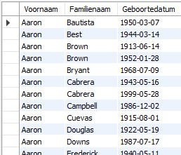
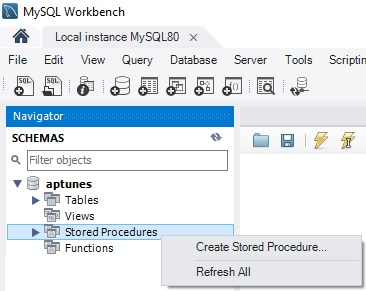
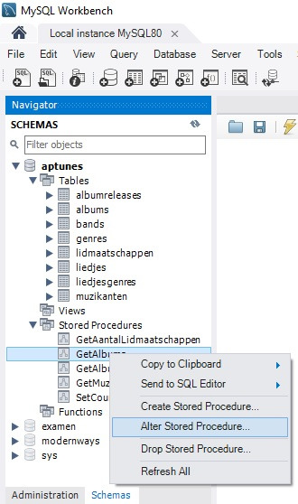

# Stored procedures

## Inleiding
Een stored procedure is, in essentie, een reeks stappen die opgeslagen zijn als één geheel in de database zelf. Procedures rechtstreeks opslaan in de database heeft aanzienlijke voordelen:

- **Vermindert het netwerkverkeer:** In plaats van meerdere lange sql statements vanuit een applicatie over het netwerk te versturen, moeten applicaties in geval van stored procedures alleen de naam en parameters van de opgeslagen procedures aan te roepen.
- **Centraliseer zakelijke logica in de database zelf:** Stored procedures kunnen gebruikt worden om de business logica te implementeren. Ze moeten dus maar één keer geschreven worden, maar kunnen door meerdere client applicaties gebruikt worden.
- **Database is veiliger:** De databasebeheerder kan passende rechten toekennen aan applicaties die alleen toegang hebben tot specifieke stored procedures zonder dat er rechten op de onderliggende tabellen moeten worden gegeven. Bovendien is invoer duidelijk afgebakend, zodat SQL-injectie (een klassieke methode om databases te hacken) uitgesloten wordt.

## Aanmaken en bewerken

### CREATE
Wanneer we onderstaand sql-statement uitvoeren, krijgen we de inhoud van de tabel muzikanten te zien.

```sql
SELECT 
    Voornaam,
    Familienaam,
    Geboortedatum
FROM 
    Muzikanten
ORDER BY Voornaam, Familienaam, Geboortedatum;
```

Resultaat:



Mogelijk willen we deze opdracht wel vaker uitvoeren, of willen we een bepaalde gebruiker toestaan deze opdracht uit te voeren maar niets anders. Een mogelijke optie is om deze opdracht bij te houden als stored procedure.


Een tweede optie is om dit met een view te doen, maar die worden elders besproken.


Bovenstaand statement kan omgezet worden naar een stored procedure als volgt: Binnen MySQL Workbench kiezen we binnen de sectie "Stored Procedures" via de rechtermuisknop voor "Create Stored Procedure". Daarna vullen we aan tot we dit hebben:



```sql
CREATE PROCEDURE `GetMuzikanten` ()
BEGIN
    SELECT 
        Voornaam,
        Familienaam,
        Geboortedatum
    FROM 
        Muzikanten
    ORDER BY Voornaam, Familienaam, Geboortedatum;
END
```


Deze code is niet geldig als .sql-script. Enkel de code die hierna wordt getoond is geldig als .sql-script.


Dan klik je op "Apply". Dit genereert dan code die je als script zou kunnen uitvoeren. De uitvoer zal zijn \(de betekenis van de gegenereerde extra's komt verderop aan bod\):

```sql
DELIMITER $$ -- betekent dat een statement pas afgesloten is na $$ i.p.v. ;
USE `aptunes`$$ -- we willen de procedure koppelen aan deze database
CREATE PROCEDURE `GetMuzikanten` ()
BEGIN
    SELECT 
        Voornaam,
        Familienaam,
        Geboortedatum
    FROM 
        Muzikanten
    ORDER BY Voornaam, Familienaam, Geboortedatum;
END$$ -- nu mag de CREATE PROCEDURE pas worden uitgevoerd

DELIMITER ; -- vanaf hier betekent ; weer dat een instructie mag worden uitgevoerd
```

Eens deze code is uitgevoerd, is er een stored proceudre met naam `GetMuzikanten`.

## Oproepen

Het `CALL` statement gebruikt een stored procedure. Dit komt op hetzelfde neer als het oproepen van een methode in een "general purpose" programmeertaal zoals TypeScript.

```sql
CALL GetMuzikanten();
```

Dit toont hetzelfde resultaat als de voluit geschreven `SELECT`-instructie.

## Stored procedure aanpassen

De meest eenvoudige manier is om binnen MySQL Workbench rechts te klikken op de stored procedure die je wil wijzigen en dan voor de optie "alter stored procedure" te kiezen.



Nu krijg je opnieuw de definitie van de stored procedure en kan je wijzigen aanbrengen. Als je klaar bent, klik je op "apply".

MySQL Workbench zal het review venster openen. In dit review venster zie je dat er eerst een `DROP PROCEDURE` wordt uitgevoerd, waarna de gewijzigde stored procedure opnieuw wordt aangemaakt met het `CREATE PROCEDURE`. Nogmaals op "apply" duwen wijzigt de stored procedure.

