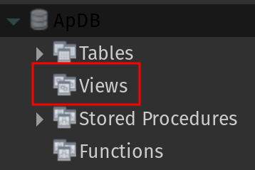

# Views

Een view is een "virtuele" tabel die gebaseerd is op het resultaat van een query. De data van een view worden niet opgeslagen in de database. De gegevens worden telkens opnieuw uit tabellen opgehaald op basis van de query en dit wanneer betreffende view wordt geconsulteerd.

Een view bestaat uit rijen en kolommen zoals een fysieke tabel. Je kan een view op dezelfde manier gebruiken als een echte tabel: je kan er complexe queries voor schrijven met alle clausules voor `SELECT` die je al kent.

## CREATE

### Syntax

```sql
CREATE VIEW viewnaam
AS
SELECT ??? -- hier kan vanalles komen, maar er wordt een resultatenset getoond
```

### Voorbeeld

We baseren ons voorbeeld op onderstaande tabellen `Taken` en `Leden`.

`Taken` is een **gewone** tabel die er zo uitziet:

| omschrijving | Id | Leden\_Id |
| :--- | :--- | :--- |
| bestek voorzien | 1 | 2 |
| frisdrank meebrengen | 2 | 1 |
| aardappelsla maken | 3 | 3 |

`Leden` is een gewone tabel die er zo uitziet:

| voornaam | Id |
| :--- | :--- |
| Yannick | 1 |
| Bavo | 2 |
| Max | 3 |

Het uitganspunt van een view is data samen te brengen en te benaderen als één nieuwe virtuele tabel.

Onderstaande query haalt bepaalde data op uit de tabellen `Taken` en `Leden`.

```sql
SELECT Leden.voornaam, Taken.omschrijving
FROM Taken
INNER JOIN Leden
ON Leden.Id = Taken.Leden_Id;
```

Het resultaat van deze query is:

| voornaam | omschrijving |
| :--- | :--- |
| Yannick | frisdrank meebrengen |
| Bavo | bestek voorzien |
| Max | aardappelsla maken |

Als we het resultaat van bovenstaande query willen opslaan in een view, doen we dit op volgende manier:

```sql
CREATE VIEW ToekenningenTaken
AS
SELECT Leden.voornaam, Taken.omschrijving
FROM Taken
INNER JOIN Leden ON Leden.Id = Taken.Leden_Id;
```

Eens je bovenstaande query `CREATE VIEW` hebt uitgevoerd wordt de view bewaard in de database.

In MySQL Workbench kan je een view vinden onder deze rubriek:



Net zoals wanneer je een nieuwe tabel aanmaakt, moet je eerst Workbench refreshen om een nieuwe view te zien.

Nu kan je deze view bevragen zoals een gewone tabel.

```sql
SELECT *
FROM ToekenningenTaken;
```

Wel belangrijk te weten dat een view de data niet fysisch bevat, maar telkens de query zal uitvoeren. Indien de query om de data te verzamelen inefficiënt opgesteld is, zal het dus langer duren om een view te raadplegen dan een klassieke tabel.

# BESLUIT
Views bieden heel wat voordelen, o.a.

* Vereenvoudiging van complexe queries. Views zijn vooral nuttig ingeval je vaak eenzelfde complexe query moet uitvoeren.
* Afscherming van gevoelige data. Als een of meer tabellen gevoelige data bevatten, dan kan je opteren om enkel de relevante en niet gevoelige data in een view op te slaan. Je kan bepaalde gebruikers dan ook toegang geven tot enkel de views, maar niet tot de oorspronkelijke tabellen.
